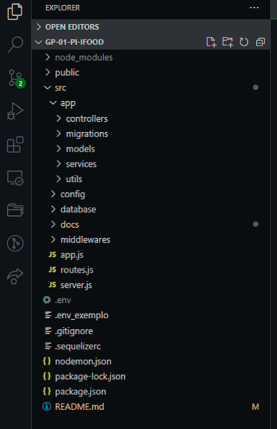

#  EASY MOTEL - Sistema de Buscas 

Bem-vindo(a) Projeto Integrador do Grupo 1 do curso DH, Potência Tech e Ifood.

<div align="center">
  
</div>

## Sobre o projeto

O EASY MOTEL é um sistema usado para consulta de disponibilidade de quartos nos Motéis e
reservas com base numa cadeia de estabelecimentos cadastrados. O sistema visa
evitar que os potenciais clientes se locomovam até algum motel e somente lá descubram não
ter quarto disponível.<br/><br/>

## Sobre o curso

Curso de back-end com Node Js ofertado pelo Ifood ministrado pela Digital House em parceria com a Potência Tech.

 &ensp;&ensp;&ensp;&ensp;  &ensp;&ensp;&ensp;&ensp; 
<br/><br/>


## Algumas ferramentas e tecnologias utilizadas

-   **Documento de Requisitos** entregue na primeira sprint como base
-   **GitHub** com merge na main via pull request com aprovação
-   **Trello** com cards estruturados para orientação das atividades
-   **Consulta a Documentações** das bibliotecas e ferramentas
-   **VS Code** como editor de código
-   **Insomnia** para execução testes das funcionalidades
-   **Swagger** para documentar a aplicação
-   **Diversas ferramentas adicionais como... Express, JWT (Json Web Token), Sequelize, Yup e etc.**<br/><br/>

## Estrutura


<br/><br/>

## Dados necessários para rodar o projeto localmente
- Clonar do repositório
```bash
  https://github.com/danimichelydev/GP-01-PI-Ifood.git
```
- Instalar as dependências
```bash
  npm install
```
- Setar as variáveis de ambiente criando um arquivo .env e editá-lo de acordo com o .env_exemplo setando as informações do banco de dados MySQL local.
```bash
  .env
```
- Fazer as migrações das tabelas 
```bash
  npx sequelize-cli db:migrate
```
* Inserir dados no banco e utilizar as rotas

## Autores

-   [Caio Santos](https://github.com/caiofsb)
-   [Dani Michely](https://github.com/danimichelydev/)
-   [Genesis Lima](https://github.com/g-101)
-   [Julissy Tocachelo](https://github.com/julissy)
